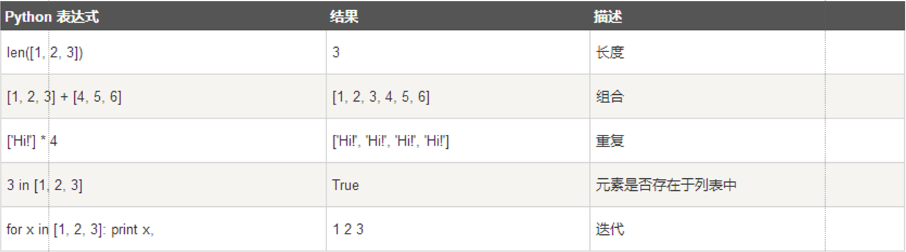

# 输出

## 通过 print()函数，其基本格式如下：

```python
print([value, … ][, sep=‘ ‘][, end=‘\n’][, file=sys.stdout][, flush=False])
```

## 参数：

- value： 要输出的对象，可以是整数，小数，字符串等
- sep： value 对象之间的间隔字符，默认为空格
- end： 输出完后的字符，默认为回车符（因此 print 完会自动换行）
- file： 输出对象，默认为 sys.stdout，即命令行界面，若输出到文件，此处参数应为文件对象
- flush： 刷新缓冲区，默认为 False，即所有 print 内容一起输出
- 返回值：没有返回值

<br>

# 缩进

## 通常靠 4 个空格进行缩进

### 注意：不可乱用空格和 Tab

<br>

# 导入模块

```python
import math
```

<br>

# 新式的格式化字符串

## 采用字符串类型中的 format 方法实现，基本语法如下：

### “字符串内容，缺省的内容用一对{}表示”.format(值列表，依次与{}对应)

如：

```python
text = “我的名字是{}，我的年龄是{}”.format(“Lam”, 18)
```

text = “我的名字是 Lam，年龄是 18”

format 中的值列表从 0 开始进行索引，花括号中可以通过索引值指定待填充的值，如：

```python
text = “我的名字是{0}，我的年龄是{1}”.format(“Lam”, 18)
```

text = “我的名字是 Lam，年龄是 18”

```python
text = “我的名字是{1}，我的年龄是{0}”.format(“Lam”, 18)
```

text = “我的名字是 18，年龄是 Lam”

花括号中，还可以在索引值后加冒号（:），后面可以指定待填值的宽度和格式，如：

```python
text = “我的名字是{0:5s}，我的身高是{1:5.1f}”.format(“Lam”, 1.74)
```

text = “我的名字是 Lam□□(长度为 5 的字符串)，我的身高是 □□1.7(长度为 5，保留一位小数的浮点数)(字符串默认左对齐)

# 布尔类型

下面的几种情况会被认为是 FALSE：

- 为 0 的数字，包括 0, 0.0；
- 空字符串' '，""；
- 表示空值的 None；
- 空集合，包括空元祖(),空序列[],空字典{}

# 列表

有序的元素集体，与 C 中的数组相同

## 1、列表的创建

创建一个列表，只要把逗号分隔的不同的数据项用方括号 [] 括起来即可，比如：

```python
list1 = [‘中国’, ‘美国’, 1997, 2000]
```

注意：

- 列表不需要指定长度，通过被赋予的内容决定长度
- 列表中的元素可以是不同类型
- 列表的内容采用方括号，不是花括号

## 2、列表的访问

### （1）通过下标索引访问

Python 中的列表与 C 中的数组一样，可以通过下标来访问列表中的元素，从而实现元素的读写

下标索引从 0 开始，访问时用方括号括住要访问的元素下标，如：

```python
list1 = [‘中国’, ‘美国’, 1997, 2000]
print(list1[0])		#输出中国
list1[3] = 1998		#将2000改为1998
```

### （2）通过切片访问

为了方便访问，Python 提供了切片（截取一段元素）和组合的方式进行访问，采用冒号（：）来实现。一般的方式如下：

```python
list1[开始下标 : 结束下标 : 步长]
```

表示引用 list1 列表从开始下标，间隔步长个元素，一直访问到（结束下标-1）(注意：不能达到结束下标的元素)的位置。例如：

```python
list1 = [‘中国’, ‘美国’, 1997, 2000]
print(list1[0:4:2])	 #输出list1[0]和list1[2]组成的列表，即[‘中国’, 1997]
```

特别地，开始下标或结束下标可以为负值，相当于逆方向索引。例如：

```python
list1 = [‘中国’, ‘美国’, 1997, 2000]
print(list1[0:-1:2])	 #负索引-1相当于正索引3，因此该切片相当于list1[0:3:2]
print(list1[-3:3])	 #相当于list1[1:3]
```

步长为负数，表示倒序访问，此时开始下标应大于结束下标。例如：

```python
list1 = [‘中国’, ‘美国’, 1997, 2000]
print(list1[3:1:-1])	 #输出由list1[3]和list1[2]组成的列表，即[2000, 1997]
```

缺省

- 缺省步长，默认步长为 1
- 缺省开始下标，表示从 0 开始
- 缺省结束下标，表示到最后一个元素
- 开始下标、结束下标和步长都缺省，表示从第一个元素逐个输出到最后一个元素

## 3、列表元素的删除

### 方法一：使用 del 语句删除列表中的元素。比如：

```python
list1 = [‘中国’, ‘美国’, 1997, 2000]
del list1[0]     #list1为[‘美国’, 1997, 2000]
```

### 方法二：使用列表结构下的 remove()方法删除列表中的元素。其基本格式为：

list.remove(待删除元素值)

比如：

```python
list1.remove(1997）     #list1为[‘中国’, ‘美国’, 2000]
```

### 方法三：使用列表结构下的 pop()方法删除列表中指定位置的元素，无参数时删除最后一个元素。

比如:

```python
list1 = [‘中国’, ‘美国’, 1997, 2000]
a = list1.pop()     #删除最后一个元素，list1为[‘中国’, ‘美国’, 1997], 且a被赋予删除掉的元素，即a = 2000
a = list1.pop(1)   #删除下标为1的元素，list2为[‘中国’, 1997]，且a被赋予’美国’
```

## 4、添加列表元素

### 方法一：使用 append(被添加元素值)方法在列表末尾添加元素

比如：

```python
list1 = [‘中国’, ‘美国’, 1997, 2000]
list1.append(31.4）     #list1为[‘中国’, ‘美国’, 1997, 2000, 31.4]
```

### 方法二：使用 extend 将一个列表中每个元素分别添加到另一个列表中，只接受一个参数, 且该参数只能为列表 list 形式

比如：

```python
list1 = [‘中国’, ‘美国’, 1997, 2000]
list2 = [1, 2, 3, 4]
list1.append(list2） #list1 为[‘中国’, ‘美国’, 1997, 2000, [1, 2, 3, 4]]
list1.extend(list2) #list1 为[‘中国’, ‘美国’, 1997, 2000, 1, 2, 3, 4]，list1 共扩展成长度为 8 的列表，后面的 4 个元素来自于 list2
```

### 方法三：使用 insert(index，value)将一个元素插入到列表中，有参数有两个，第一个参数 index 是索引点，即插入的位置，第二个参数 value 是插入的元素。其中，index 的起始位置从 0 开始。

比如：

```python
list1 = [‘中国’, ‘美国’, 1997, 2000]
list1.insert(1, 31.4)     #list1为[‘中国’, 31.4, ‘美国’, 1997, 2000]
```

### 方法四：使用符号+将两个列表 list 相加连接起来，会返回给一个新的 list 对象

比如：

```python
list1 = [‘中国’, ‘美国’, 1997, 2000]
list2 = [1, 2, 3, 4]
list3 = list1 + linst2 #list3 为新列表，值为[‘中国’, 31.4, ‘美国’, 1997, 2000, 1, 2, 3, 4]
```

注意：采用+拼接列表会返回一个新列表，与 append, extend 和 insert 不同，不会改变参与操作的列表的值

## 5、列表排序

#### 方法一：调用列表结构下的 sort(reverse=False)方法，参数 reverse 表示排序顺序，默认为 False，表示升序；若设置为 True，表示降序。

比如：

```python
list1 = [5, 2, 3, 1, 4]
list1.sort() #list1 为[1, 2, 3, 4, 5]
list1.sort(reverse=True) #list1 为[5, 4, 3, 2, 1]
```

### 方法二：调用内置函数 sorted(列表，reverse=False) ，该函数会返回一个排好序的新列表。

比如：

```python
list1 = [5, 2, 3, 1, 4]
list2 = sorted(list1) #list1 不变，list2 为[1, 2, 3, 4, 5]
list2 = sorted(list1, reverse=True) #list1 不变，list2 为[5, 4, 3, 2, 1]
```

## 6、定义多维列表

可以将多维列表视为列表的嵌套，即多维列表的元素值也是一个列表，只是维度比父列表小一
比如：

```python
list1 = [["CPU", "内存"], ["硬盘","声卡"]]
```

二维列表比一维列表多一个索引，可以如下获取元素：
列表名[索引 1][索引2]

比如：

```python
print(list1[0][1])    #输出“内存”
```

## 7、列表的操作符



## 8、列表的常用方法

1. list.append(obj)：在列表末尾添加新的对象
2. list.extend(seq)：在列表末尾一次性追加另一个序列中的多个值
3. list.insert(index, obj)：将对象插入列表
4. list.pop(index)：移除列表中的一个元素，默认最后一个元素，并返回该元素的值
5. list.remove(obj)：移除列表中某个值的第一个匹配项
6. list.sort([func])：对原列表进行排序
7. list.count(obj)：统计某个元素在列表中出现的次数，比如：

```python
list1 = [1, 2, 2, 3, 4, 3, 2, 3, 2]
print(list1.count[2])	#输出4
```

8. list.index(obj)：从列表中找出某个值第一个匹配项的索引位置，比如：

```python
list1 = [1, 2, 2, 3, 4, 3, 2, 3, 2]
print(list1.index(3))	#输出3
```

9. list.reverse()：反转列表中元素顺序，比如：

```python
list1 = [1, 2, 2, 3, 4, 3, 2, 3, 2]
list1.reverse()	#list1为[2, 3, 2, 3, 4, 3, 2, 2, 1]
```

## 9、列表常用的内置函数

1. len(list)：返回列表元素个数，比如：

```python
list1 = [1, 2, 2, 3, 4, 3, 2, 3, 2]
print(len(list1))		#输出9
```

2. max(list)：返回列表元素最大值

```python
list1 = [1, 2, 2, 3, 4, 3, 2, 3, 2]
print(max(list1))		#输出4
```

3. min(list)：返回列表元素最小值，比如：

```python
list1 = [1, 2, 2, 3, 4, 3, 2, 3, 2]
print(min(list1))		#输出1
```

4. list(seq)：将元组转换为列表，比如：

```python
tup1 = (1, 2, 2, 3, 4, 3, 2, 3, 2)
list1 = list(tup1)		#list1为[1, 2, 2, 3, 4, 3, 2, 3, 2]
```

# 元组

元组（tuple）与列表类似，不同之处在于元组的元素不能修改

## 1、元组的创建

用圆括号包含以逗号分隔的元素，比如

```python
tup1 = (‘中国’, ‘美国’, 1997, 2000)
```

空元组只需要一对圆括号，比如

```python
tup1 = ()
```

只有一个元素的元组，最后需要添加一个逗号，比如

```python
tup1 = (50,)
```

## 2、元组的访问

用方括号指定要访问的下标索引，比如：

```python
tup1 = (‘中国’, ‘美国’, 1997, 2000)
print(tup1[1])	#输出美国
```

同样支持切片（截取）访问

```python
print(tup1[0:4:2])		#输出(‘中国’, 1997)，注意，输出也是元组
print(tup1[:-2:-1])		#输出(2000,)，注意，只有一个元素时最后的逗号不能省
```

## 3、元组的连接

元组的元素值不能改变，但能进行连接组合，通过符号+实现，比如：

```python
tup1 = (12, 34, 56)
tup2 = (78, 90)
tup3 = tup1 + tup2	#tup3的值为(12, 34, 56, 78, 90)
```

### 4、元组的删除

元组的元素不能删除，这里指的是对整个元组进行删除，通过 del 语句实现，比如：

```python
tup1 = (12, 34, 56)
del tup1		#注意，del是关键字，不是函数，不用圆括号
print(tup1)		#tup1已经被删除，这里的输出会报错
```

### 5、元组的运算符

与列表类似，只是操作对象为元组


### 6、元组的内置函数

元组的内置函数同样包括 len, max 和 min，其用法与列表相同
不同的是，元组的内置函数 tuple，实现将列表转换为元组的功能，比如：

```python
list1 = [1, 2, 3, 4]
tup1 = tuple(list1)		#tup1的值为(1, 2, 3, 4)
```

### 7、利用元组对多个变量赋值

元组可以实现多个变量同时赋值，比如：

```python
(x, y, z) = (1, 2, 3)		#执行后x=1, y=2, z=3
```

实质上，此处的圆括号可以省略，即写成

```python
x, y, z = 1, 2, 3
```

注意，Python 中不能支持 x=1, y=2, z=3 这样的逗号表达式
利用上述方式，可简单实现两个元素的交换，比如：

```python
x, y = y, x		#赋值是同时进行，不存在先后问题
```

元组的意义

1. 元组处理数据的速度比列表快，尤其在遍历数据时
2. 对不需要修改的数据进行“写保护”，可以使代码更加安全。

# 字典

## 字典的创建需要注意以下几点：

### （1）键建议唯一，值可以重复，若键值重复，取最后定义为准，比如：

```python
dist1 = {“abc” : 123, “abc” : 456} ×  #不建议的定义，dist1 值为{“abc” : 456}
dist1 = {“abc” : 123, “def” : 123} √  #合理的定义
```

### （2）键必须是不可变的对象（如常量或元组），但值可以是任意类型的对象，比如：

```python
dist1 = {[‘Paul’, 20021234] : 95} ×  #错误的定义，列表不能为键
dist1 = {(‘Paul’, 20021234) : 95} √  #合理的定义，元组元素不可变
dist1 = {93.4 : [1, 2, 3, 4]} ×  #浮点数也可以为键，列表可以为值
```

## 2、访问字典里的值

访问字典里的值时把相应的键放入方括号里，比如：

```python
dist1 = {“abc” : 123, 93.5 : [“a”, “b”, “c”]}
print(dist1[“abc”])	#输出123
print(dist1[93.5])		#输出[“a”, “b”, “c”]
```

## 3、增加/修改字典元素

修改字典中的元素，可通过[键]的方式引用字典元素并对其重新赋值
若字典中不存在所引用的键值，则向字典添加相应的键/值对。
比如：

```python
dist1 = {“abc” : 123, 93.5 : [“a”, “b”, “c”]}
dist1[“abc”] = “hahaha”		#dist1键”abc”对应的值被更改为”hahaha”，dist1的值为{“abc” : “hahaha”, 93.5 : [“a”, “b”, “c”]}
dist1[123] = (3, 4, 4)		#dist1中没有键123，键/值对123:(3,4,4)被添加，dist1的值为{“abc” : “hahaha”, 93.5 : [“a”, “b”, “c”], 123 : (3, 4, 4)}
```

## 4、删除字典元素

删除字典中的一个键/值对，采用 del 语句，通过[键]方式引用待删元素，比如：

```python
dist1 = {“abc” : 123, 93.5 : [“a”, “b”, “c”]}
del dist1[93.5]	#删除后的dist1为{“abc” : 123}
```

清空整个字典，采用 clear()方法，比如：

```python
dist1 = {“abc” : 123, 93.5 : [“a”, “b”, “c”]}
dist1.clear()	#dist1为空字典{}
```

注意：用 clear 方法后，dist1 中的元素删除了，但 dist1 还在；若要删除 dist1，可以采用 del dist1 语句实现

## 5、in 运算

用于判断某键是否在字典里，但对 value（值）不适用，比如：

```python
dist1 = {“abc” : 123, 93.5 : [“a”, “b”, “c”]}
print(“abc” in dist1)	#输出为True
print(123 in dist1)	#输出为False，因此只对键适用
```

## 6、字典常用的方法

#### （1）dist.clear()：删除字典内所有的元素

##### （2）dist.fromkeys(seq[, val])：创建一个新字典，以序列 seq 中元素做字典的键，val 为字典所有键对应的初始值。比如：

```python
dist1 = {}				#要先定义空字典
dist1.fromkeys([“a”, “b”, “c”], 0)	#生成的dist1为{“a” : 0, “b” : 0, “c” : 0}
dist1.fromkeys([“x”, “y”, “z”], [1, 2, 3])	#由于val参数只有一个，所有以seq为键的值都为val，因此dist1为{“x” : [1, 2, 3], “y” : [1, 2, 3], “z” : [1, 2, 3]}
```

#### （3）dist.get(key, default=None)：返回指定键的值，如果键不在字典中返回 default 值。比如：

```python
dist1 = {“abc” : 123, 93.5 : [“a”, “b”, “c”]}
print(dist1.get(“abc”))			#输出123
print(dist1.get(“def”, 666))		#键“def”不在字典中，输出666
```

注意：键不在字典时只输出 default 值，不会改变字典的元素

#### （4）dist.setdefault(key, default=None)：和 get()类似，但如果键不在字典中，将会添加键并将值设为 default。比如：

```python
dist1 = {“abc” : 123, 93.5 : [“a”, “b”, “c”]}
print(dist1.setdefault(“abc”)) #输出 123
print(dist1.setdefault(“def”, 666)) #键“def”不在字典中，输出 666，且 dist1 变为{“abc” : 123, 93.5 : [“a”, “b”, “c”], “def” : 666}
```

注意：不存在的键被添加到字典中，且值为 default

#### （5）dist.update(dist2)：把字典 dist2 的键/值 对更新到 dist1 中。比如：

```python
dist1 = {“abc” : 123, 93.5 : [“a”, “b”, “c”]}
dist2 = {“A” : 90, “B” : 80, “C” : 70}
dist1.update(dist2)	#dist1被更新为{“abc” : 123, 93.5 : [“a”, “b”, “c”], “A” : 90, “B” : 80, “C” : 70}
```

#### （6）dist.keys()：返回一个键所组成的视图对象（迭代器）。比如：

```python
dist1 = {“abc” : 123, 93.5 : [“a”, “b”, “c”]}
obj1 = dist1.keys() #obj1 的值为 dist_keys([“abc”, 93.5])
```

注意：obj1 是迭代器，可用于循环遍历（循环结构时详说）；可以用 list(obj1)方法将其转换为列表

#### （7）dist.values()：返回一个值所组成的视图对象（迭代器）。比如：

```python
dist1 = {“abc” : 123, 93.5 : [“a”, “b”, “c”]}
obj1 = dist.values() # obj1 的值为 dist_values[123, [“a”, “b”, “c”]]
```

#### （8）dist.items()：返回一个由(键, 值)元组对所组成的视图对象（迭代器）。比如：

```python
dist1 = {“abc” : 123, 93.5 : [“a”, “b”, “c”]}
obj1 = dist1.items() #obj1 的值为 dist_items([(“abc”, 123), (93.5, [“a”, “b”, “c”])])
```

dist.keys(), dist.values()和 dist.items()常用于循环结构中构造循环范围，比如：for key, value in dist.items(): … 表示遍历 dist 里所有的键/值对，每个对用 key 表示键，用 value 表示对应的值

## 注意：字典与列表和元组不同，不是用下标索引来引用元素，而是用键，因此字典是一种无序的数据结构。

### 字典的无序，体现在不能对字典进行重新排序

#### （9）dist.copy()：返回一个字典的副本（浅复制）。比如：

```python
dist1 = {“abc” : 123, 93.5 : [“a”, “b”, “c”]}
dist2 = dist1.copy()	#dist2的值为{“abc” : 123, 93.5 : [“a”, “b”, “c”]}
```

# 集合

集合（set）是一个无序不重复元素的序列。集合基本功能是进行成员关系测试和删除重复元素

## 1、创建集合

可以使用大括号({})或者 set()和 frozenset()函数创建集合。set()创建的是可变集合；frozenset()创建的是不可变集合。比如：

```python
set1 = { 1, 2, 3, 2, 1}
set2 = set(“hello”)
set3 = frozenset([10, 20, 30])
```

**注意：创建一个空集合必须用 set() 和 frozenset()，而不是 { }，因为 { } 是用来创建一个空字典。**

## 创建集合时的一些细节问题：

### （1）由于集合是不重复的序列，因此创建时如果有重复的，创建后会被去除，比如：

```python
set1 = { 1, 2, 3, 2, 1}
print(set1)		#输出是{1, 2, 3}，后面重复的2和1被去除
```

### （2）用{}创建时，括号里直接填集合元素值，用逗号分隔；用 set()和 frozenset()创建时，参数必须是可迭代的，即一个序列、字典和迭代器等，比如：

```python
set1 = {“hello”} #集合里只有一个元素，为字符串{”hello”}
set2 = set(“hello”) #集合为{“l”, “o”, “h”, “e”}
set3 = {1, 2, 3, 2, 1} #集合为{1, 2, 3}
set4 = set(1, 2, 3, 4) #出错，set 的参数不可迭代
set5 = set([1, 2, 3, 2, 1]) #集合为{1, 2, 3}，与 set3 相同
```

### （3）在集合里，对于有大小的数据（如整数，浮点数），创建后的集合会按从小到大顺序存放；对于无大小的数据（如字符串，字典），创建后的顺序是无序的。

## 2、成员测试

用 in、not in 来判断集合元素存在/不存在。比如：

```python
set1 = set(“hello”)
print(“h” in set1) #输出 True
print(“a” not in set1) #输出 True
```

### 3、集合运算

可以使用“-”、“|”、“&”、”^”运算符进行集合的差集、并集、交集和对称集运算。比如：

```python
set1 = set(“abcd”)
set2 = set(“cdef”)
print(set1 - set2) # a 和 b 的差集，a – a 交 b，输出{“a”, “b”}
print(set1 | set2) # a 和 b 的并集，输出{“a”, “b”, “c”, “d”, “e”, “f”}
print(set1 & set2)# a 和 b 的交集，输出{“c”, “d”}
print(set1 ^ set2)# a 和 b 中不同时存在的元素，输出{“a”, “b”, “e”, “f”}
```

## 4、集合中添加元素

### （1）add()方法向集合内增加元素，如果添加的元素已经存在，则不执行任何操作。比如：

```python
set1 = set([1, 2, 3, 2, 1])
set1.add(1) #set1 的值为{1, 2, 3}
set1.add(4) #set1 的值为{1, 2, 3, 4}
```

###（2）update()方法也可以添加元素，且参数可以是列表、元组、字典等，可以有多个参数，用逗号分开。比如：

```python
set1 = set("hello")
set1.update(“world”, “haha”)
print(set1) #输出{'h', 'r', 'e', 'a', 'o', 'd', 'w', 'l'}
```

## 5、删除集合元素

### （1）remove(x)方法将元素 x 从集合 s 中移除，如果元素不存在，则会发生 KeyError 错误。比如：

```python
set1 = set(“hello”)
set1.remove(“l”)		#set1为{“h”, “e”, “o”}
set1.remove(“a”)		#报错
```

### （2）discard()方法与 remove()方法相同，只是如果元素不存在，则不会发生 KeyError 错误。比如：

```python
set1 = set(“hello”)
set1.discard(“l”) #set1 为{“h”, “e”, “o”}
set1.discard(“a”) #什么都不执行，也不报错
```

### （3）pop()方法从集合中删除并且返回一个任意的值。比如：

```python
set1 = set(“hello”)
a = set1.pop()		#set1为{“h”, “e”, “o”}, a为”l”
b = set1.pop()		#set1为{“h”, “o”}, b为”e”
```

**注意：由于是任意的值，因此每次执行的结果会不一样。这种方式多用于需要从集合中随机删除或抽取一个元素时使用**

## 6、删除集合所有元素

clear()方法删除集合中所有元素。比如：

```python
set1 = set(“hello”)
set1.clear() #集合变为空集 set()，注意，不是{}，但 set1 还是存在
```

# 控制语句

## IF 语句

if 语句的语法形式如下所示：

```python
if 条件表达式 ：
    语句 1
```

与 C 语言写法不同之处：

1. 条件表达式不需要圆括号括起（括起也没错）
2. 条件表达式后的冒号不能省，表示条件成立时要执行的语句开始
3. Python 中不用花括号构建复合语句（没有复合语句），所有语句通过缩进决定其归属。每个缩进单位为四个空格

## IF…ELSE…语句

if…else 语句的语法形式如下所示：

```python
	if 表达式 ：
	    语句1
	else ：
	    语句2
```

细节：

1. else 与 if 位置相同
2. else 后面也需要冒号，表示条件不成立时的语句开始
3. 同样通过缩进决定语句的范围

## IF…ELIF…ELSE…语句

if…elif…else…语句的语法形式如下所示：

```python
if 表达式1 ：
    语句1
elif 表达式2 ：
    语句2
    ……
elif 表达式n ：
    语句n
else ：
    语句n+1
```

## PASS 语句

Pass 语句类似于空语句，可以用在类和函数的定义中或者选择结构中作为以后代码的预留空间。比如：

```python
a = int(input(“请输入第一个数：”))
b = int(input(“请输入第二个数：”))
if a < b:
    pass		#什么都不做
else:
    print(a, “>”, b)
```

## while 语句

Python 中的 while 语句与 C 语言相同，只是写法上有一点区别。while 语句的基本形式如下：

```python
while 判断条件：
	执行语句
```

与 if 语句格式类似，判断条件不用括号；判断条件后
需要加冒号；所有同缩进的语句都归同一层

## while…else…语句

while 语句还可以搭配 else 语句使用，效果相当于在 while 里执行 if…else…语句，但写法更简洁。其基本格式如下：

```python
while 判定表达式：
    语句1
else：
    语句2
```

等价于

```python
while 判定表达式：
    if 判断表达式：
        语句1
    else：
        语句2
        break
```

其执行逻辑是：当判定表达式成立，执行语句 1，并进入下一轮循环；当判定表达式不成立，执行语句 2，然后结束循环。因此语句 2 只有循环结束时被执行一次

## for 语句

for 语句可以遍历任何序列的项目，如一个列表、元组或者一个字符串
for 语句的语法格式如下：

```python
for 循环索引值 in 序列：
	循环体
```

python 中 for 的格式与 C 语言相差较大，需要注意以下几个细节：

1. Python 中的 for 是通过循环索引值遍历序列中的值，序列可以是列表，元组或字典等，循环索引值依次提取序列中的每个元素，用 in 来关联索引值与序列。循环直到遍历结束为止
2. 与 while 格式类似，注意冒号，缩进等的书写要求

## 列表生成式

列表生成式是 Python 内置的一种极其强大的生成 list 列表的表达式，借助循环结构，简单完成范围大的列表生成。
列表生成式的基本语法格式如下：

## [元素表达式 for 循环索引值 in 迭代器 [if 条件表达式]]

1. 元素表达式，即列表的每个元素，可以是一个变量，也可以是表达式
2. 循环索引值，一般是元素表达式中的索引值
3. 迭代器，索引值遍历的范围，可以是 range，列表，字典的 keys 等
4. 条件表达式，控制在遍历时的条件，可选

### (1）生成 1~100 的奇数列表

```python
[x for x in range(1, 101, 2)]
```

### （2）生成 1~10 以内偶数的平方和列表

```python
[x*x for x in range(2, 11, 2)]
```

### （3）生成 1~100 能被 7 整除或有数字 7 的数组成的列表

```python
[x for x in range(1, 101) if x % 7 == 0 or x // 10 == 7 or x % 10 == 7]
```

## 列表生成式还可以实现多层循环迭代，比如：

### （4）生成所有扑克牌

花色：“黑桃”，“红桃”，“梅花”，“方块”

数字：”A”, “2”, “3”, “4”, “5”, “6”, “7”, “8”, “9”, “10”, “J”, “Q”, “K”

分别用 color 和 num 两个列表表示花色和数字，每一张扑克牌实质上是一个花色加一个数字组成。利用列表生成式可以写成：

```python
color = [“黑桃”，“红桃”，“梅花”，“方块”]
num = [”A”, “2”, “3”, “4”, “5”, “6”, “7”, “8”, “9”, “10”, “J”, “Q”, “K”]
poke = [m+n for m in color for n in num]
```

## 列表生成式还可以从字典中一次读进多个元素来生成列表，比如

### （5）生成虚拟按键列表

```python
virtual_keys = {“A” : “left”, “S” : “down”, “W” : “up”, “D” : “right”}
d = [k + “->” + v for k, v in virtual_keys.items()]
```
