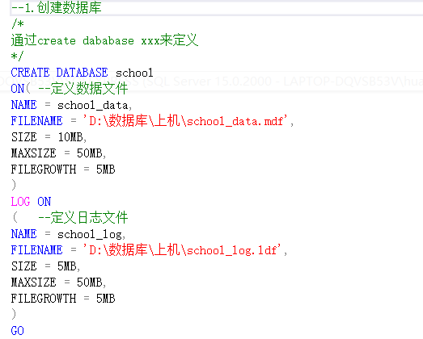
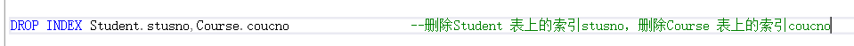
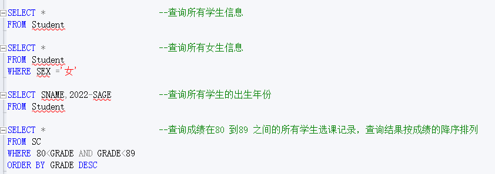

## 数据模型分类：

1. 概念模型
2. 逻辑模型和物理模型
   - 逻辑模型包括：层次模型、网状模型、关系模型、面向对象数据模型、对象关系数据模型、半结构化模型
   - 物理模型描述数据再系统内部的表示方式和存取方式

## 数据模型三要素

- 数据结构集合
- 数据结构操作
  - 查询
  - 修改：增、删、改
- 完整性约束集合

## 数据库三级模式

- 模式
  - 也称，逻辑模式、结构模式、概念模式
  - 全体数据的逻辑结构和特征的描述
  - 数据库系统模式的中间层
- 外模式
  - 也称，子模式，用户模式
  - 使用局部数据的逻辑结构和特征描述
  - 介于模式和应用之间
  - 模式与外模式是一对多的关系
  - 外模式与应用是一对多的关系
  - 保证数据库安全性
- 内模式
  - 也称，储存模式
  - 是数据结构和储存方式的描述
  - 一个数据库只有一个内模式

## 数据独立性

1. 物理独立性
2. 逻辑独立性

## 关系数据库模型组成

- 关系数据结构
  - 关系
  - 二维表
- 关系操作集合
  - 查询：选择、投影、连接、除、并、交、差
  - 更新：插入、删除、修改
- 关系完整性约束
  - 实体完整性
  - 参照完整性
  - 用户定义完整性

# SQL 语言


## 创建数据库

```SQL
CREATE DATABASE <数据库名>
[ ON[PRIMARY]
[<Filespec>[，…N] ]
[，<Filegroupspec>[，…N]]
 ]
[LOG ON {<Filespec> [，…N]}]
```



## 删除数据库


## 创建表

```SQL
CREATE TABLE <表名>
    (<列名> <数据类型>[ <列级完整性约束条件>]
    [,<列名> <数据类型>[<列级完整性约束条件>]] …
    [,<表级完整性约束条件>]);
<表名>：所要定义的基本表的名字
<列名>：组成该表的各个属性（列）
<列级完整性约束条件>：涉及相应属性列的完整性约束条件
<表级完整性约束条件>：涉及一个或多个属性列的完整性约束条件
```


## 删除基本表

```SQL
DROP TABLE <表名>;
```

基本表删除 数据、表上的索引都删除
表上的视图往往仍然保留，
但无法引用

删除基本表时，系统会从数据字典中删去有关该
基本表及其索引的描述


## 修改基本表

```SQL
ALTER TABLE <表名>
ADD <新列名> <数据类型> [ 完整性约束 ]
DROP <完整性约束名>
MODIFY <列名> <数据类型> ；
```

- \<表名>：要修改的基本表
- ADD 子句：增加新列和新的完整性约束条件
- DROP 子句：删除指定的完整性约束条件
- MODIFY 子句：用于修改列名和数据类型


## 创建索引

建立索引语句格式

```SQL
CREATE [UNIQUE][CLUSTER] INDEX <索引名>
ON <表名>(<列名>[<次序>][,<列名>[<次序>]]…);
```

用\<表名>指定要建索引的基本表名字
索引可以建立在该表的一列或多列上，各列名之间用逗号分隔

用\<次序>指定索引值的排列次序，升序：ASC，降序：DESC。缺省值：ASC
UNIQUE 表明此索引的每一个索引值只对应唯一的数据记录
CLUSTER 表示要建立的索引是聚簇索引，最多只能建立一个


## 删除索引

```SQL
DROP INDEX <索引名>；
```



## 插入元组

```SQL
INSERT
INTO <表名> [(<属性列1>[,<属性列2 >…)]
VALUES (<常量1> [,<常量2>] … )
```

功能：将新元组插入指定表中。


## 修改数据

```SQL
UPDATE  <表名>
   SET <列名>=<表达式>[,<列名>=<表达式>]…
   [WHERE <条件>]；
```

功能：修改指定表中满足 WHERE 子句条件的元组


## 删除数据

```SQL
DELETE FROM   <表名>
    [WHERE <条件>];
```

功能：删除指定表中满足 WHERE 子句条件的元组

WHERE 子句

- 指定要删除的元组
- 缺省表示要修改表中的所有元组


## 查询(基本表查询和视图查询)

```SQL
SELECT [ALL|DISTINCT]<目标列表达式>[,<目标列表达式>]…
 FROM <表名或视图名>[,<表名或视图名>] …
 [ WHERE <条件表达式> ]
 [ GROUP BY <列名1> [ HAVING <条件表达式> ]
 [ ORDER BY <列名2> [ ASC|DESC ] ；

```




```SQL
--用嵌套查询所有选修1号课程的学生（用EXISTS）
     SELECT Sname
     FROM Student
     WHERE EXISTS
       (SELECT *
        FROM SC          /*相关子查询*/
        WHERE Sno=Student.Sno AND Cno='1');
```

```SQL
--查询其他系中比信息系任意一个(其中某一个)学生年龄小的学生姓名和年龄
    SELECT Sname,Sage
    FROM    Student
    WHERE Sage<ANY(SELECT Sage      --关键字ANY
                   FROM Student
                   WHERE Sdept='IS')
          AND Sdept<>'IS';/*注意这是父查询块中的条件*/
```

```SQL
--查询每个学生及其选修课程的情况包括没有选修课程的学生----用外连接操作
SELECT Student.Sno,Sname,Ssex,Sage,Sdept,Cno,Grade
 FROM    Student
 LEFT JOIN SC ON                  --关键字LEFT JOIN左外链接（RIGHT JOIN右外链接）
         Student.Sno = SC.Sno;
```

## E-R 图实例


