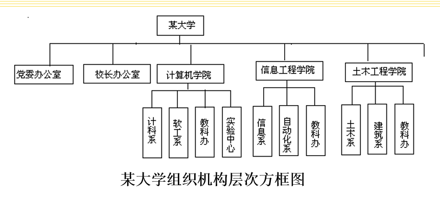

# 第一章 概述

>## 软件的定义

### 软件= 程序 + 数据 + 文档

#### 软件是程序、数据以及开发、使用和维护程序需要的所有文档的完整集合。

 

>## 软件的特点

- 是一种逻辑产品，有抽象性
- 生产主要是开发研制，没有明显的制造过程
- 在使用过程中，不存在磨损、消耗、老化等问题
- 开发主要是脑力活动，产品“定做的”，生产效率低
- 成本相当昂贵，软件费用不断增加
- 对硬件和环境有不同程度的依赖性
- 是复杂的
   

>## 软件的分类

### 从计算机系统角度：系统软件、应用软件

### 从软件用途： 服务类、维护类和操作管理类

 

>## 软件危机的产生原因

- 产品规模庞大，结构复杂
- 开发的管理困难
- 开发费用不断增加，维护费用急剧上升，威胁计算机应用的扩大
- 开发技术落后
- 生产方式落后
- 开发工具落后，生产效率提高缓慢

 

>## 解决途径

- 正确认识软件，清除“软件就是程序”的错误观念
- 使用好的开发技术和方法，研究探索更好更有效的技术和方法
- 有良好的组织、严密的管理，各类人员相互配合
- 开发和使用好的软件工具

 

>## 软件工程的目标

- 降低开发成本
- 满足用户要求的全部软件功能
- 符合用户要求、令用户满意的软件性能
- 有较好的易用性、可重用性和可移植性
- 较低的维护成本，较高的可靠性
- 按合同要求完成开发，即使交付用户

 

>## 软件工程三要素

 

### 方法

提供一系列软件开发技术

 

### 工具

为软件方法提供了自动或半自动的支撑环境。

 

### 过程

将软件工程的方法和工具综合起来，进行开发

 

>## 关系

 

>## 研究内容（两方面）

- 软件开发技术

  - 开发方法
  - 开发过程
  - 开发工具和技术

- 开发过程管理
  - 工程经济学
  - 软件管理学

 

>## 软件工程基本原理

- 用分阶段的生存周期计划严格管理
- 坚持进行阶段评审
- 实行严格的产品控制
- 采用现代程序设计技术
- 结果能清楚地审查
- 开发人员少而精
- 承认不断改进软件工程实践地必要性

 

>## 软件工程知识域

### 软件技术知识域

- 软件需求
- 软件设计
- 软件构造
- 软件测试
- 软件维护

### 软件管理知识域

- 软件配置管理
- 软件工程管理
- 软件工程过程
- 软件工程工具与方法
- 软件质量
- 相关学科知识领域

 

>## 软件工程发展史

### 程序设计阶段——50 至 60 年代

- 1946 年到 1956 年为程序设计年代

### 程序系统阶段——60 至 70 年代

- 1956 年到 1968 年为程序系统年代，程序+说明

### 软件工程阶段——70 年代以后

- 1968 年至今为软件工程年代，程序+文档

 

>## 软件过程

### 定义：把输入转化为输出的一组彼此相关的资源和活动

### 内容：

1. 软件规格说明：规定软件的功能及运行限制
2. 软件设计开发：产生满足规格说明的软件
3. 软件测试确认：对软件能否满足用户要求进行确认
4. 软件演进：为满足用户的变更要求的演进

### 特性：

1. 可理解性
2. 可见性
3. 可支持性
4. 可接受性
5. 可靠性
6. 健壮性
7. 可维护性
8. 速度

 

>## 软件生存周期：

### 软件计划时期：

1. 问题定义
2. 可行性研究

### 软件开发时期：

1. 需求分析
2. 概要设计
3. 详细设计
4. 编码
5. 测试

### 软件运行维护时期

 

>## 软件开发模型

1. 瀑布模型
2. 快速原型模型
3. 增量模型
4. 螺旋模型
5. 喷泉模型
6. 基于构件的开发模型
7. 统一过程模型
8. 基于形式化的模型

 

>## 瀑布模型

### 各个活动由前至后、互相衔接的固定次序。包括：

问题定义、可行性研究、需求分析、概要设计、详细设计、编码、测试和维护。

### 瀑布模型特点

- 阶段的顺序性和依赖性：前段输出文档即后段输入文档
- 推迟实现的观点
- 质量保证的观点：
  - 每一阶段必须完成规定相应文件
  - 每一阶段结束之前必须对已完成文档进行评审
- 存在的问题
  - 是一种理想的线性开发模式，缺乏灵活性
  - 无法解决软件需求不明确或不准确的问题

 

>## 快速原型模型

### 思想：快速建立一个能够反映用户主要需要的原型系统，快速地修复原型系统,反复改进

 

>## 增量模型

### 思想：“逐渐”开发出来的，把软件产品作为一系列的增量构件来设计、编码、组装和测试

### 每个构件由互相作用的模型构成，能完成特定的功能。

 

>## 螺旋模型

### 加入风险分析，即将瀑布模型和增量模型结合，弥补前两种模型的不足

### 是一种风险驱动模型

### 特点：

- 瀑布模型+快速原型+风险分析
- 迭代过程

### 一个螺旋周期：

- 取得目标，选择方案，选定策略
- 风险角度分析策略
- 启动开发方案
- 评价前一轮结果，计划下一轮工作

 

>## 喷泉模型

### 一种面向对象软件开发模型

### 以用户需求为动力，以对象作为驱动的模型

### 优点：

- 各阶段没有明显界限，可同步开发
- 可提高项目开发效率，节省时间，适应面向对象开发过程

### 缺点

- 开发阶段重叠，需要大量开发人员，不利于项目管理
- 要求严格管理文档，审核难度加大，尤其面对信息变动大的情况

### 特点

- 分布式特点
- 测试充分
- 完全实现测试开发同步，及各个过程、阶段同步

 

>## 基于构件的开发模型

### 构件：经过一定设计和实现的类，在某个领域具有通用性

### 模型原理：利用预先封装的软件构件构造应用软件系统

 

>## 统一过程模型

### 基于面向对象统一建模语言 UML 的一种面向对象的软件过程模型

 

>## 基于形式化的开发模型

### 变换模型：严格的、数学的表示体系表示软件规格说明

### 净室模型：力求分析设计阶段消除缺陷

 

>## 对比

|        模型        |          特点           |
| :----------------: | :---------------------: |
|      瀑布模型      |   经典，需求变化不大    |
|    快速原型模型    |    快速获取用户需求     |
|      增量模型      |   灵活，允许软件变化    |
|      螺旋模型      |        加入风险         |
|      喷泉模型      |  典型面向对象开发模型   |
| 基于构件的开发模型 | 提高软件重用性和可靠性  |
|    统一过程模型    | 基于 UML 的 OO 过程模型 |
|  基于形式化的模型  |     确保严格、无错      |

### *OO 模型即面向对象设计模型

 

>## 传统软件工程方法

- 结构化技术（分析、设计、实现）完成各项开发任务
- 软件生存周期划分阶段，顺序完成任务
- 阶段开始结束由严格标准，前后阶段工作衔接
- 阶段结束前正式进行严格技术审查和管理审查

 

>## 面向对象软件工程方法

### 开发阶段界限模糊，开发过程逐步求精，开发活动（在分析、设计和实现阶段）反复迭代

### 种类：

- Booch 方法
- OMT 方法
- OOSE 方法
- Code/Yourdon 的面向对象分析和设计方法
- UML

 

## 现代软件开发基本策略

- 软件复用：复用已有构件
- 分而治之：问题分解
  - 内聚性是一个模块或子系统内部的依赖程度
  - 耦合性是两个模块或子系统之间以来关系的强度
  - 系统分解的目标：高内聚，低耦合
- 逐步演进：软件开发是自底而上的生长过程
- 优化折中：优化各质量特性，协调实现整体质量最优
   
   
   
   

# 第二章 可行性研究

>## 可行性研究目的和任务

### 目的：用最小的代价在尽可能短的时间内确定问题是否能解决

### 任务：经济可行性、技术可行性、操作可行性和法律可行性

 

>## 经济可行性（成本——效益分析）

- 成本估算
  - 专家估算技术（Delphi 技术）
  - 成本估算模型（COCOMO）
- 效益估算

  - 投资回收期
  - 纯收入
  - 投资回收率

   

>## 技术可行性（技术风险分析）

- 技术解决方案的实用性
  - 使用的技术实用化程度
  - 技术解决方案合理程度
- 技术资源的可用性
  - 参与人员的工作基础
  - 基础硬件/软件的可用性
  - 软件工具实用性

### 技术可行性困难：

- 技术发展快
- 领域知识不熟悉
- 系统目标、功能和性能不确定

 

>## 操作可行性

- 用户类型：外行型/熟练型/专家型
- 操作习惯
- 使用单位的计算机使用习惯
- 使用单位的规章制度

 

>## 法律可行性（侵权和责任问题）

- 专利法
- 著作权
- 版权
- 软件保护条例

 

>## 可行性研究步骤

1. 复查并确定系统规模和目标
2. 研究目前正在使用的系统
3. 建立新系统的高层逻辑模型
4. 到处和评价各种方案
5. 推荐可行方案
6. 草拟初步的开发计划
7. 编写可行性研究报告提交审查

 

>## 系统流程图

### 系统流程图：描述物理系统的工具

作用：用图形符号以黑盒子形式描述组成系统的主要成分

 

>## 成本-效益分析

### 系统成本：

- 开发成本
- 运行维护成本

### 系统效益：

- 有形的经济效益
- 无形的社会效益

 

>## 货币的时间价值

### 年利率为 i，现存 P 元，n 年后可得 F 元

F = P *（1 + n * i）

### 相反，n 年后能收入 F 元，这些钱现在现在价值

P = F / （1 + n * i）

### 若计复利则，P元钱在n年后的价值：

F = P * (1 + i) * n次方，

### 如果n年后能收入F元钱，那么这些钱现在的价值是：

P = F / (1 + i) * n次方

 

>## 投资回收期

### 定义：使累计经济收益等于最初投资费用所需要的时间

### 纯收入：整个生存周期累计收益与投资之差

 

>## 社会可行性

- 是否满足所有项目涉及者的利益
- 是否满足合同要求

 
 
 
 

# 第三章 软件需求分析

>## 需求分析任务

1. 确定对系统的综合需求
   - 功能需求
   - 性能需求
   - 环境需求
   - 接口需求
   - 用户界面需求
   - 其他需求（可靠性、安全性、保密性、可移植性等）
2. 分析系统的数据需求
   - 建立数据模型----实体联系图（ER 图）
   - 描述数据结构----层次方框图和 Warnier 图
3. 建立软件的逻辑模型
   - 数据流图
   - 数据字典
   - 实体-联系图
   - 主要处理算法
4. 编写软件需求规格说明书
   - 目的：明确定义目标系统需求、系统构造及有关接口
5. 需求分析评审
   - 目的：发现需求分析错误和缺陷。修改开发计划

 

>## 需求分析步骤

1. 需求获取：研究调查
2. 需求提炼：分析建模
3. 需求描述：编写 SRS
4. 需求验证

 

>## 需求获取方法

1. 客户访谈
   - 正式访谈
   - 非正式访谈
   - 调查表
2. 建立联合分析小组（用户、系统分析员、领域专家组成）
3. 问题分析与确认

 

>## 需求分析常用方法

1. 功能分解方法
   - 方法组成：功能、子功能和功能接口
   - 思想：自顶向下，逐步求精
   - 缺点难以适应用户的需求变化
2. 结构化分析方法
   - 一种从问题空间到某种表示的映射方法
   - 软件功能由数据流图表示
   - 数据流图和数据字典组成系统的逻辑模型
   - 优点：使用简单，适用于数据处理领域问题
3. 信息建模方法
   - 从数据的角度对现实世界建立模型
   - 基本工具：实体联系图（实体、属性和联系构成）
4. 面向对象方法
   - 关键：识别、定义问题域内的类与对象

 

>## 结构化分析方法

 

### 自顶向下逐层分解的分析策略

### 结构化分析工具

*结构化分析方法分类：非形式化、半形式化和形式化

半形式化工具：

- 数据流图
  - 表示逻辑模型，描述数据流动和处理过程
  - 没有具体物理元素
  - 考虑软件系统必须完成的基本功能，不考虑具体实现
  
  
  
  
  - 画图步骤：
    1. 先找外部实体，确定源点和终点
    2. 找出输入输出数据流
    3. 图边画出外部实体
    4. 画出变换数据的加工
  - 注意事项：
    1. 只考虑数据流静态关系
    2. 只考虑常规状态
    3. 不是画程序流程图，二者有区别
    4. 不可能一次画成
    5. 复杂系统要分层成子图和父图，子父图要平衡（子加工不超过7个）
  - 用途
    - 作为交流信息工具：
      1. 供有关人员审查
      2. 供用户理解和评价
    - 作为分析设计工具
      1. 描述系统完成的功能
      2. 辅助物理系统设计时，以定时要求为指南，画出自动化边界，对应不同物理系统
- 数据字典
  - 关于数据信息的集合
  - 内容
    1. 数据流
       - 表明数据逻辑流向，是数据项或数据结构
    2. 数据流分量/数据基本项（最小单位项）
       - 被称为数据元素具有独立逻辑含义的最小数据单位。定义：
          1. 数据项名称、编号、别名、简述
          2. 数据项取值范围
          3. 数据项长度
    3. 数据存储/文件
       - 数据流暂时或永久保存之地
    4. 加工/处理
       - 对数据流程图DFD最底层的处理逻辑加以说明
  - 常用符号
  
    
    - 
- 描述加工逻辑的***结构化语言、判定表和判定树***等
  - 方法：
    1. 结构化语言
        - 介于自然语言和程序语言之间
        - 特点：
          - 关键字固定语法
          - 自然语言的自由语法
          - 数据说明手段
          - 模块定义和调和技术  
    2. 判定表
   
        组成部分：
        - 左上所有条件
        - 左下所有可能动作
        - 右上各种条件组成的矩阵
        - 右下每种条件组合对应的动作
  
        例：

        
    3. 判定树

      

 

>## 需求分析图形工具
### 层次方框图
  
### Warnier图
  
### IPO图
  

 

>## SA方法应用
- 项目说明
- 数据流图
- 数据字典

 

>## 数据库内容需求分析
- 任务：调查、收集、分析并定义用户对数据库各种要求
- 工作方面：
    1. 信息需求：从数据库获得的信息的内容和实质
    2. 处理需求：用户要求系统完成的功能、处理时间、方式等
    3. 使用需求：
       - 数据库安全性、完整性、一致性限制
       - 输入输出格式和多用户方面限制
       - 响应速度、故障回复等性能要求
- 需求分析采取建立数学模型，采用实体-联系图（E-R图）描述
    1. 建立各局部应用E-R模型
    2. 建立全局E-R模型
- E-R图要素：
    - 数据对象（实体）：客观世界存在事物。矩阵表示
    - 联系：事物之间三类联系，1对1(1:1)，1对多(1:N)，多对多(M:N)。菱形表示
    - 属性：实体或联系具有的性质。椭圆或圆角矩形表示
  

 

>## 需求规格说明书
### 内容：
   1. 引言编写目的、项目背景、定义、参考资料
   2. 任务概述：目标、运行背景、定义、条件与约束
   3. 数据描述：静态数据、动态数据、数据库描述、数据字典等
   4. 功能需求：功能划分、功能描述
   5. 性能需求：数据精确度、时间特性、适应性
   6. 运行需求：用户界面、硬件接口、软件接口、故障处理
   7. 其他需求：可使用性、安全保密性、可维护性和可移植性等
 
 
 
 

# 第四章 软件总体设计

>## 总体设计目标任务
步骤：
1. 设想选择的方案
2. 选取合理方案
3. 推荐最佳方案
4. 功能分解
5. 设计软件结构
6. 设计数据库
7. 制定测试计划
8. 书写文档
9. 审查复查

 

>## 结构设计准则

### 体系结构设计准则
- 体系结构是对复杂事物的一种抽象
- 在一定时间内保持稳定
- 良好的体系结构意味着普通、高效和稳定
### 模块设计准则
- 降低模块间耦合性，提高内聚性
- 模块结构深度、宽度、扇出和扇入应适当
  - 深度：模块层数，表示控制层数
  - 宽度：同一层次上模块最大个数
  - 扇出：一个模块直接调用的模块数目
  - 扇入：直接调用它的上级模块的数量
- 模块的作用范围应在控制范围之内
  - 作用范围：模块内一个判断影响的所有模块集合
  - 控制范围：模块本身及所有直接或间接从属的模块集合
- 模块接口设计要简单，降低复杂程度和冗余度
- 设计功能可预测并能得到验证的模块
- 适当划分模块规模，保持其独立性

 

>## 设计的概念和原理
### 模块化的作用
- 软件结构清晰
- 容易测试调试
- 提高软件可修改性
### 模块重要特征：***抽象***和***隐藏***

## 模块独立性及度量
### 独立性：模块化、抽象、信息隐藏和局部化概念的直接结果
### 独立性要求：每个模块完成独立子功能，和其他模块关系简单
### 独立的重要性：
- 有效模块化的软件容易开发
- 独立模块比较容易测试和维护
### 耦合类型
1. 无直接耦合
2. 数据耦合
3. 标记耦合
4. 控制耦合
5. 公共环境耦合
6. 内容耦合

### 耦合设计原则
- 尽量使用数据耦合
- 少用控制耦合和标记耦合
- 限制公共环境的范围
- 完全不用内容耦合

### 内聚类型
1. 偶然内聚
2. 逻辑内聚
3. 时间内聚
4. 通信内聚
5. 顺序内聚
6. 功能内聚

结论：偶然内聚、逻辑内聚属于低内聚，通信内聚属于中内聚，顺序内聚和功能内聚属于高内聚。

尽可能做到**高内聚**。

 

>## 数据库设计
### 数据库系统三级模式：外模式、模式、内模式

 

>## 结构设计图形工具
### 图形工具：
- 软件结构体
  - 软件结构图是软件系统的模块层次结构，表达组成模块及调用关系
  - 基本符号
    - 模块：方框表示
    - 模块调用关系：单向箭头或直线连接
    - 辅助符号：弧形箭头表示循环调用；菱形表示选择或条件调用
    - 
- 层次图
  - 
  - 层次图和层次方框图区别：

    ||层次图|层次方框图|
    |:----:|:----:|:----:|
    |作用|描述软件结构|描述数据结构|
    |矩形框|模块|数据元素|
    |连线|调用关系|组成关系|
- HIPO图

 

>## 机构化设计方法
### 信息流类型
- 交换流
- 事物流

### 机构化设计方法步骤：
1. 复审数据流图，可进行修改或优化
2. 确定数据流图类型
3. 分解上层模块，设计中下层模块结构
4. 根据软件结构设计准则对软件结构求精并改正
5. 导出接口描述和全程数据结构
6. 复审

### 变换型分析设计
1. 确定逻辑输入输出边界，找出变换中心
2. 设计软件结构顶层和第一层
   - 顶层：是整个系统要达到的目标，完成所有模块的控制
   - 第一层：至少有输入、输出和变换中心
     - 输入模块：协调所有输入数据的接收
     - 变换中心：管理内部形式数据的所有操作
     - 输出模块：协调输出信息的产生过程
3. 设计中下层模块
   - 自顶向下，逐步细化，为每个模块设计下属模块
4. 对结构图优化
   - 输入输出求精
   - 变换部分求精：高内聚，低耦合

### 事务性分析设计
1. 确定事务中心、输入流和活动路径
2. 设计软件结构顶层和第一层
   - 顶层：接收数据，根据事务类型调度响应处理模块
   - 第一层：一个接收分支，一个发送分支
3. 设计中下层模块
   - 为每一种事务处理设计一个处理模块
   - 为事务处理设计操作模块
   - 为操作模块设计细节模块
4. 对结构图优化

>## 总体设计说明书
主要内容：
1. 引言：编写目的、项目背景、定义、参考资料
2. 任务概述：目标、运行环境、需求概述、条件与限制
3. 总体设计
4. 接口设计：外部接口、内部接口
5. 数据结构设计
6. 运行设计
7. 出错处理设计
8. 安全保密设计
9. 维护设计

 
 
 
 

# 第五章 软件详细设计
>## 详细设计目的和任务
### 目的：确定实现所要求系统的具体方法
### 任务
- 确定每个模块所用**算法**
- 确定每个模块所用**数据结构**
- 确定每个模块**接口细节**
- 为每个模块设计一组**测试用例**

 

>## 结构化程序
### 特征
- 一个入口
- 一个出口
- 程序中无死语句
- 程序中无死循环

 

>## 详细设计工具
种类：
- 图形工具：传统程序流程图、盒图和问题分析图（PAD）等
- 表格工具：判定表、判定树等
- 语言工具：过程设计语言（PDL）等
  
### 程序流程图
#### 最古老、应用最广泛、且最有争议的的描述详细设计的工具
基本结构：顺序结构、选择结构、循环结构

优点：表达直观、结构清晰、易于理解、易于修改

### 盒图（N-S图）

操作方法：
- “处理步骤”用一个盒子表示
- 盒子中还可以嵌套盒子
- 上边进入盒子从下边走出
- 作为详细设计描述手段时常需两个盒子：数据盒、模块盒
  
### 优点：
1. 功能域明确
2. 容易确定局部和全局数据作用域
3. 不可能任意转移控制
4. 很容易表达模块层次、并列或者嵌套关系
5. 强制设计人员按SP方法进行思考并描述设计方案，有效保证设计质量
6. 简单、易学易用，可用于软件教育和其他方面

### 问题分析图（PAD图）
#### 支持SP方法，具有顺序、选择、循环三类成分

### 过程设计语言（PDL）
#### “混杂式语言”，分为“外语法”和“内语法”

### PDL特点
1. 关键字的固定语法
2. 自然语言的自由语法
3. 具有数据说明机制
4. 模块定义和调用技术

### 优点：
- 可作为注释直接插在程序中间
- 可使用普通正文编辑程序或文字处理系统
- 同自然语言（英语）很接近，易于理解
- 语言形式，易于计算机处理
- 同程序同结构，自动产生程序比较简单

### 缺点：
- 不如图形工具形象直观
- 描述复杂条件组合与动作的相应关系时，不如判定表清晰简单

 

>## 人机设计界面
### 需考虑问题：
- 系统响应时间：长度和易变性
- 用户帮助设施
- 出错信息处理
- 命令交互

### 设计原则
- 界面简洁、控件摆放规范、颜色统一、符合用户习惯
- 让用户驾驭软件
- 尽可能减少用户记忆负担
- 保持界面一致性

### 设计步骤
- 建立任务目标和意图
- 建立界面需求规格模型
- 以上一步为依据创建用户界面原型
- 用户试用并评估该界面原型
- 根据用户意见修改原型实现下一原型
- 重复以上步骤
- 在上述步骤中以界面原型创建进行界面设计迭代

 

>## 详细设计说明书
### 主要内容
1. 引言：编写目的、项目背景、定义、参考资料
2. 程序描述（所有模块）：功能、性能、输出和输入项目、算法、程序逻辑、接口、储存分配、限制条件、测试要点等

 
 
 
 

# 第六章 软件编码

>## 程序设计语言分类
### 分类：基础语言、结构化语言和面向对象语言

### 基础语言：
- FORTRAN：科学和工程计算
- COBOL：商业数据处理
- BASIC：数值计算、事务处理、具有人机会话功能
- ALGOL：结构化语言前驱

### 结构化语言
- Pascal：数值计算和非数值计算问题、自编译语言
- C：编写应用软件和编译程序、操作系统等
- Ada：嵌入式风格、模块化设计、编译检查、平行处理、异常处理及范式编程

### 面向对象语言
- C++：C进化产物，保留C语言特征，融合面向对象能力
- Java语言：面向对象，不依赖特定平台

 

>## 语言选择的实用标准有：
- 待开发软件的应用领域
- 用户需求
- 软件的运行环境
- 软件开发人员的知识
- 软件的可移植性要求

 

>## 程序设计风格内容
1. 程序内部文档
2. 数据说明
3. 语句结构
4. 输入输出
5. 效率

### 程序内部文档：
- 标识符的选取
- 程序的注解：
  - 序言性注释：模块首部，描述模块整体功能
  - 功能性注释：源程序内部，描述程序段或语句处理功能
- 程序的布局：适当利用阶梯形式

### 数据说明
- 数据说明次序应标准化
- 一个语句说明多个变量，最好按**字典顺序排列**
- 适当加注解

### 语句构造原则
- 多个语句不可在同一行
- 避免复杂条件测试，减少对“非”条件测试
- 避免大量循环使用嵌套语句和条件嵌套语句
- 利用圆括号时逻辑表达式后算术表达式的运算次序清晰直观
- 变量说明初始化要正确，变量说明不要遗漏

### 输入输出风格原则
- 对所有输入数据都要进行校验
- 检查输入项重要组合合法性
- 保持简单输入格式
- 输入数据时，使用数据或文件结束标志，不要用计数来控制
- 人机交互输入时，详细说明可用的选择范围和边界值
- 当程序设计语言对输入/输出格式有严格要求时，应保持输入格式与输入语句的要求一致
- 输出报表的设计要符合用户要求，输出数据尽量表格化、图形化
- 对所有输出数据加标志，并加以必要的注解

### 效率
#### 主要指处理机工作时间和内存容量的利用率
三原则：
- 效率属于性能要求，应在软件需求分析阶段确定效率方面要求
- 良好的设计可以提高效率
- 提高程序的效率和好的编码风格要保持一致，不应该一味追求程序效率而牺牲程序清晰性和可读性

 
 
 
 

# 第七章 软件测试
>## 软件测试
### 软件测试保证软件质量的关键，时对需求分析、设计和编码的最终复审

 

### 软件测试原则
1. 既有输入数据，也应有输出结果
2. 选用合理的输入数据，还应选择不合理的输入数据
3. 检查是否做了该做的工作，还应检查是否做了不该做的工作
4. 应远在测试开始之前就制定测试计划
5. 测试计划、测试用例、测试报告必须作为文档长期保存
6. 错误会出现“聚集性”现象
7. 应避免测试自己的程序

### 测试方法分类
动态测试：被测程序在机器上运行
静态测试：不在机器上运行被测程序
根据测试用例设计方法不同，分为**黑盒测试**和**白盒测试**

### 人工测试
#### 不依靠计算机，完全靠人工审核软件
方法：
- 桌前检查
- 代码会审
- 步行检查

### 白盒测试
特点：
- 需了解程序内部结构
- 测试用例是根据程序的内部逻辑来设计的
- 如果想用白盒法发现程序中所有的错误，则至少必须使程序中每种可能的路径都执行一次
- 应用白盒测试时，手头需要有程序的功能说明书和程序清单

### 白盒测试
- 测试用例：测试输入数据和预期的输出结果
- 测试方案：测试目的、测试用例的集合
  - 语句覆盖：被测试程序中的每条语句至少被执行一次
  - 判定覆盖：使得被测试程序中每个判定表达式至少获得一次 True 和 False
  - 条件覆盖：使得判定表达式中每个条件的各种可能的值至少出现一次
  - 判定/条件覆盖：使得判定表达式中的每个条件的所有可能取值至少出现一次，并使每个判定表达式所有可能的结果也至少出现一次
  - 条件组合覆盖：设计足够多的测试用例，使得每个判定表达式中条件的各种可能的值的组合都至少出现一次
  - 路径覆盖：覆盖测试程序中所有可能的路径

### 两种白盒测试技术：逻辑覆盖测试，路径测试

### 黑盒测试：应同时选择多种黑盒测试的方法
黑盒测试又称功能测试，着重测试软件的功能
- 等价类划分法
  - 把程序的输入数据集合按输入条件划分为若干个等价类，每个等价类相对于输入条件表示为一组**有效**或**无效+**的输入
  - 为每一个等价类设计一个测试用例
- 边界值分析法：输入等价类和输出等价类的边界就是应该着重测试的程序边界情况。选取的数据应刚好**等于**、刚好**小于**、刚好**大于**边界值

### 黑盒测试可以发现的错误类型：
- 功能不全或遗漏
- 界面错误
- 数据结构错误或外部数据库访问错误
- 性能错误
- 初始化和终止错误

常用黑盒测试方法：
- 等价类划分法
- 边界值分析法
- 错误推测法

 

## 调试
调试也成为纠错，是在测试发现错误之后排除错误的过程
- 方法
  - 蛮干法
  - 回溯法
  - 原因排除法
- 结果
  - 找到了原因，改正和排除
  - 没找到原因，猜测一个原因，并设计附加测试用例来验证这个假设

 

||黑盒测试|白盒测试|
|:----:|:----|:----|
|优点|1. 适用于各个阶段测试 2.从产品功能角度测试 3. 容易入手生成测试数据|1.可构成测试数据使特定程序部分得到测试 2.有一定的充分性度量手段 3.有较多工具支持|
|缺点|1.某些代码得不到测试 2.如果规格说明有误，则无法发现 3.不易进行充分性测试|1.不易生成测试数据（通常） 2. 无法对未实现规格说明的部分进行测试 3. 工作量大，通常只用于单元测试，有应用局限|

 
 
 
 

# 第八章 软件维护
>## 软件维护分类：
- 改正性维护
  - 开发过程采用新技术
  - 利用应用软件包
  - 提高系统结构化程度
  - 进行周期性维护审查等 
  \* 改正性维护约占整个维护工作总量的21%
- 适应性维护
  - 对可能变化的因素进行配置管理
  - 将因环境变化而必须修改的部分局部化 
  \* 适应性维护约占整个维护工作总量的25%
- 完善性维护
  - 尽量采用功能强，使用方便的工具
  - 采用原型化开发方法等
  \* 完善性维护约占整个维护工作总量的50%
- 预防性维护
  - 采用提前实现
  - 软件重用等技术

 

>## 软件维护特点：
1. 是软件生存周期中延续时间最长、工作量最大的一个阶段
2. 如果维护不当，会产生副作用，甚至引起错误
3. 维护活动实际上是一个修改和简化的软件开发活动
4. 一直未受到软件设计者的足够重视

### 结构化维护与非结构维护
- 结构化维护：开发各阶段文档齐全
- 非结构化维护：唯一成分是程序代码，缺乏必要文档说明
\* 非结构化维护需要付出很大代价

 

>## 维护工作流程：
1. 建立维护机构
2. 编写软件维护工作流程
3. 确定软件维护工作流程
4. 整理软件维护文档
5. 评价软件维护性能

 

>## 软件可维护性
### 定义:指纠正软件系统出现的错误和缺陷，以及为满足新的要求进行修改、扩充或压缩的**容易程度**
具体内容：
- 可理解性
- 可测试性
- 可修改性
- 可靠性
- 可移植性
- 可使用性
- 效率

 

>## 软件度量学
### 常用方法：质量检查表、质量测试和质量标准

 

>## 提高软件可维护性的方法
方法：
- 建立明确的软件质量目标和优先级
- 使用提高软件质量的技术和工具
- 选择便于维护的程序设计语言
- 采取明确的、有效的质量保证审查措施
- 完善程序文档

 

>## 软件维护困难的表现
表现方面：
- 读懂别人的程序是困难的，文档不足更加
- 文档不一致
- 开发和维护在人员和时间上存在差异
- 软件维护不是一项吸引人的工作

 

>## 软件维护的代价
影响维护工作量的主要因素：
- 系统的大小
- 程序设计语言
- 系统年龄
- 数据库技术的应用
- 先进的软件开发技术
- 其他：如应用类型、数学模型、任务难度、if嵌套深度、索引或者下标

无形的成本：
1. 一些看起来是合理的修复或修改请求不能及时安排，使得客户不满意
2. 变更的结果把一些潜在的错误引入正在维护的软件，使得软件整体质量下降
3. 当必须把软件人员抽调到维护工作中去时，就使得软件开发工作受到干扰

 

>## 再工程与逆向工程
### 软件再工程是一类软件工程活动：
- 增进对软件的理解
- 准备或直接提高软件的可维护性、复用性或演化性

### 软件逆向工程：分析程序，力图在比源代码更高级的抽象层次上建立程序表示的过程

### 软件再工程好处：
- 可帮助软件机构降低软件演化二点风险
- 可帮助软件机构补偿软件的投资
- 可使得软件易于进一步变更
- 有广阔的市场

 
 
 
 

# 第九章 面向对象方法学

### 基本原则：尽可能模拟人类习惯的思维方式，使开发软件的方法与过程尽可能接近人类解决问题的方法与过程

>## 优点和不足
主要优点：
1. 与人类习惯思维方式一致
2. 软件稳定性好
3. 可重用性好
4. 较易开发大型软件产品
5. 可维护性好，易于测试

不足之处：
1. 需要写更多代码
2. 占用空间比较多，程序效率比较低
3. 创建对象实例的过程往往是非常耗时的工作
4. 对系统动态特征表述不充分，反应系统整体功能特征的能力比较差
5. 加大了测试的难度，给软件测试带来了不便

 

>## 面向对象基本概念
### 对象：

对问题域中客观存在的事物的抽象，是一组属性和在这些属性上的操作的封装体

\* 对象两大要素：属性（静态特征）、操作（动态特征）

### 类：

- 具有相同属性和操作的一组相似对象（实体）的集合
- 同类对象具有相同属性和方法
- 类的属性如同类自身，具有抽象、无值的特征
- 只有在通过类产生出具体对象之后，属性才有具体的之值

### 消息：
- 是面向对象系统中对象之间交互的途径
- 是对象之间建立的一种通信机制
- 一个消息的关键要素：消息的发送者、消息的接收者、消息所要求的具体服务及其参数、消息的应答等

### 封装

- 指把对象的属性和操作结合成一个独立的系统单位，尽可能隐藏对象的内部细节，又称细节隐藏
- 目的:将对象的使用者和设计者分开

>## 类与类之间的关系

### 继承：
- 既具有共享特性又具有差别或新增部分

### 多态性
- 父类定义属性或操作被子类继承，可具有不同的数据类型或表现出不同的行为
- 实现形式：
  - 编译时的多态性：重载机制
  - 运行时的多态性：继承性结合虚函数的动态绑定技术

### 关联：语义联系
- 对具有共同的结构特性、行为特性、关系和语义链接的描述
- 体现类之间语义级别的一种强依赖关系，一般是**长期性的**，且双方关系**平等**
- 关联可以是单向的、双向的

### 依赖
- 一个类使用到另一个类，使用关系具有偶然性的、临时性的、非常弱的

### 实现
- 规定接口和实现接口类之间的关系，接口是操作的集合
- 实现是类和接口之间最常见的一种关系，一个类实现接口的功能

### 聚集与组合
- 聚集：整体拥有各部分，部分与整体不是相同的生存期，整体不存在了，部分还在
- 组合：部分与整体具有相同生存周期

#### 区别
- 关联的两个对象之间是平等的，聚合则一般不平等
- 关联是一种结构化的关系，指一种对象和另一种对象有联系

***继承与实现：纵向关系***

***聚合、关联、依赖：横向关系***

***强弱关系：组合>聚集>关联>依赖***

>## 统一建模语言UML
### UML建模过程分为两阶段：
- 分析阶段：用例图、类图、活动图、类分析图、顺序图
- 设计阶段：类设计图、通信图、状态图、部署图

### UML的主要特点
- 统一的标准
- 面向对象
- 可视化，表示能力强大
- 独立于过程
- 易于掌握应用

### 特点和用途
- 使用UML进行软件系统的分析与设计，能够加速软件开发的进程，提高代码的质量，支持变动的业务需求。
- UML适用于各种大小规模的软件系统项目，能促进软件复用，方便地集成已有的系统软件资源。
- UML是一种标准的表示方法，为不同领域的人提供了一种统一的交流方法。
- UML采用面向对象的图形方式来描述任何类型的系统，因此，UML具有广泛的应用领域。
- UML的应用覆盖了从需求分析阶段到软件测试阶段的各阶段。

### UML中提供了静态图和动态图，共计13种，以及5种视图。
- 静态图 ：类图 、对象图 、用例图 、构件图 、部署图 、包图、组合结构图；
- 动态图 ：状态图 、顺序图 、通信图 、活动图、计时图、交互概览图 ；
- 视图 ：用例视图 、逻辑视图 、进程视图 、实现视图 、部署视图 ；

### RUP软件开发过程中的9个核心工作流：
1. 业务建模（Business Modeling）
2. 需求（Requirements）
3. 分析与设计（Analysis & Design）
4. 实现（Implementation）
5. 测试（Test）
6. 部署（Deployment）
7. 项目管理（Project Management）
8. 配置与变更管理（Configuration & Change Management）
9. 环境（Environment）

 
 
 
 

# 第十章 面向对象分析
>## 面向对象分析过程
### 用例模型
- 用例图建立起来的系统模型。
- 直接反应用户对目标系统的需求，描述数据在系统中的变换过程及系统功能
- 由一组用例图和数据流图组成。

### 对象模型
- 对象模型主要关心系统中**对象的结构、属性与操作**，以及对象与对象之间**关系的映射**
- 常用类图和对象图描述。

### 动态模型
- 动态模型可以借助于交互（顺序图或通信图）或状态机（状态图或活动图）进行建模。
  - 交互主要用于对共同工作的群体对象的行为建模
  - 状态机则是对单个对象的行为建模
- 当问题系统涉及交互作用和时序，动态模型是重点

### 物理（实现）模型
- 物理实现模型从实现子系统和实现元素（即构件）的角度来表现系统实现的物理组成。
- 用构件图和部署图表示静态的物理实现模型，用交互图和状态机描述动态实现模型。
- 实现模型与设计模型的映射最好是保持一对一的映射关系
- 构件和节点也可以通过描述构件之间的依赖、泛化、关联和实现关系来组织构件。

>## 四种模型之间的关系
1. 针对每个类建立的动态模型，描述类实例的生存周期或运行周期
2. 状态转换驱使行为发生，这些行为在数据流图中被映射成处理，在用例图中被映射成用例，它们同时与类图中的服务相对应。
3. 用例（功能）模型中的用例（或处理）对应于对象模型中的类所提供的服务。
4. 数据流图中的数据存储及数据的源点/终点通常是对象模型中的对象。
5. 数据流图中的数据流往往是对象模型中对象的属性值，也可能是整个对象。
6. 用例图中的参与者可能是对象模型中的对象。
7. 用例（功能）模型中的用例（或处理）可能产生动态模型中的事件。
8. 对象模型描述数据流图中的数据流、数据存储及数据源点/终点的结构。
9. 物理实现模型中的构件通常对应对象模型中的类。
